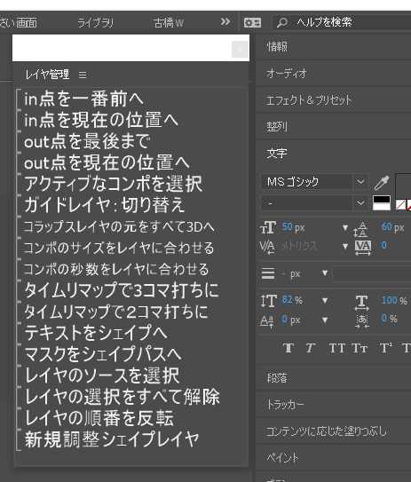
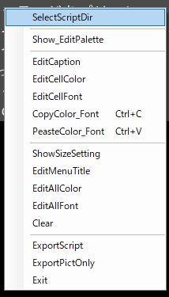
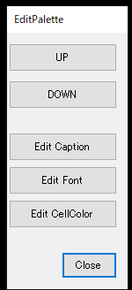

# AE_Menu
## 作ったわけ
最近のAEのscriptで簡単にメニューランチャー作るとフォントの指定ができないので文字が小さすぎて辛いです(僕が老眼なので)
かと言ってCEPでパッケージ作るのもいろいろ面倒なので作ったメニュー作成アプリです。
<div style="text-align: center;"></div>

フォルダ内にあるスクリプトとプリセットを読み取って文字だけのサムネイル画像を作成して、**iconbutton**でリスト表示させます。
画像なので文字サイズ等自由に設定できます。  

**ただ、ひたすら簡単にメニューランチャーが作れるように工夫してあります。**  
基本となるスクリプトはユーザーが勝手に編集可能です。  

## 使い方
* 適当にスクリプトをまとめたフォルダを作ります。<br>**Scripts**フォルダ内に作る場合は()でくくって読み込まないようにしておくと楽です。
* そのフォルダをこのアプリにドラッグ&ドロップするとスクリプトファイルがメニューとして表示されます。
* 右クリックして**ExportScript**を実行すると、それらのスクリプトを呼び出すメニュースクリプトが書き出されます。  

基本的に以上の操作でメニューができます。

## 変更点
* 背景色をJSX/FFXで分けるのやめました。めんどくさいので
* コピーする時フォントの情報も含めるようにした。
* FFXの読み込み時CS6とかCC2020のようにバージョン文字がないとメニューに表示しないようにスクリプトを修正。**アプリでは普通に表示されます。**
* ffxの名前にCS6/CC2020とかのバージョンがあったら削除するようにしました。


## 注意点
* プリセットファイルの登録の仕方が変わりました。対象のAEのバージョンの文字を入れないと認識しません。
* **CS6**の場合は **CS6** 、**CC2020**は **CC2020**の文字列がないとAEのスクリプトメニュー上では表示されないように仕様を変えました。
* AE_Menuアプリ自体では両方表示されますので注意です。


## ちょっとカスタマイズ
右クリックメニューで以下の事が出来ます。
<div style="text-align: center;"></div>

name | func
 --: | :--
SelectScriptDir | スクリプトフォルダを選ぶダイアログの表示。ドラッグ&ドロップの方が楽です。
Show_EditPalette |EditPaletteを表示します。 下で説明します。
EditCaption | 表示されているテキストを変更します。
EditCellColor | 選択した項目のみ背景色を変えます。
EditFont | フォントの変更を行います。
CopyColor_Font | 選択した項目の色とフォントをコピーします。
PasteColor_Font | 選択した項目へ背景色をペーストします。
ShowSizeSetteing | 項目のサイズを変更します。
EditMenuTitle | ウィンドウに表示されるテキストを変更します。
EditAllColor | すべての項目の背景色を同じ色に変更します。
EditAllFont | すべての項目の背景色を同じ色に変更します。
Clear | 初期化します。
ExportScript | メニュースクリプトを(画像も)書き出します。
ExportPictOnly | サムネイル画像のみ書き出します。
Exit このアプリを終了します。

右クリックしてEditPaletteを選ぶと簡単な操作パレットが開きます。
<div style="text-align: center;"></div>


name | func
 --: | :--
UP | 選択したした項目を上に移動
DOWN |選択したした項目を下に移動
残りは右クリックのものと同じです。  
  
このメニューのスタイルの設定は保存されません。  
実際のところここで細かな調整を行うより、書き出ししたスクリプトを修正した方が楽で速いのでそちらを推奨です。  

## 高度な使い方
このメニューアプリを実行するとexeファイルと同じ場所に同名のjsxファイル(**AE_Menu.jsx**)を書き出します。  
ExportScriptを実行する時はこのjsxファイルをテンプレートとして書き出しを行いますので、なんかあったらこれを修正です。  
修正項目等は**AE_Menu.jsx**を読んでください。

## 書き出されたスクリプトを編集
書き出されたスクリプトは以下のようになります。
```
(function(me){
	//----------------------------------
	// メニューに表示されるタイトル
	var scriptName = "簡単メニュー";
	//----------------------------------
	//読み込むフォルダ
	var cmdItemsPathBase = "./(簡単メニュー)";
	//読み込むスクリプト等
	var cmdItemsPath =[
"シンプル透過光3_CS6.ffx",
"シンプル透過光3_ふちブラシ_CS6.ffx",
"シンプル透過光3_テレサ光_CS6.ffx",
"シンプル透過光3_下敷き_CS6.ffx",
"シンプル透過光3_中央光_CS6.ffx"
	];
	// アイコンサイズ
	var iconWidth = 240; 
	var iconHeight = 20; 

	var scrolBarWidth = 30;
// 以下省略
})(this);
```

cmdItemsPathBase変数の内容を書き換えることで絶対パス・相対パスや読み込むフォルダ名を変更できます。
cmdItemsPath配列が実際のスクリプト・FFXのファイル名です。ここで順庵とか調整できます。

## Dependency
Visual studio 2019 C#


## References

## License

This software is released under the MIT License, see LICENSE

## Authors

bry-ful Hiroshi Furuhashi
bryful@gmail.com  
twitter:bryful
